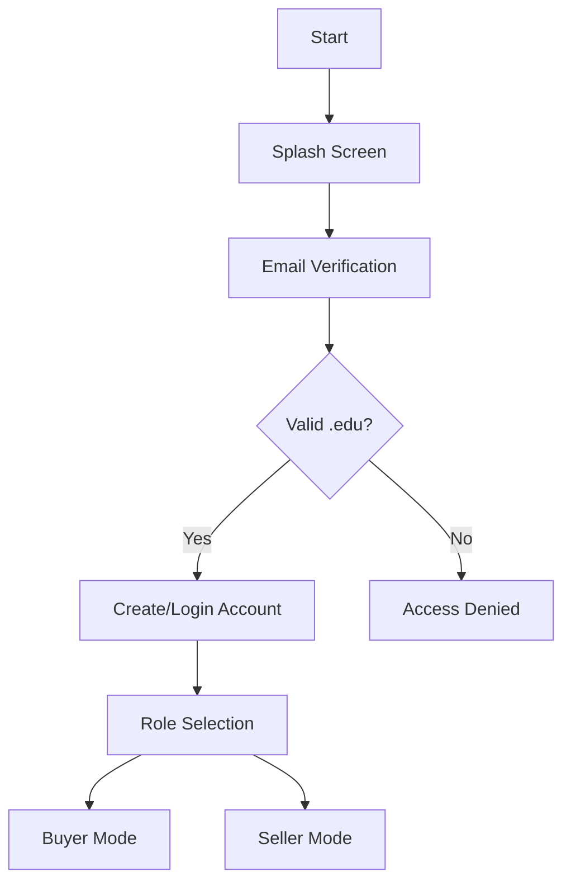
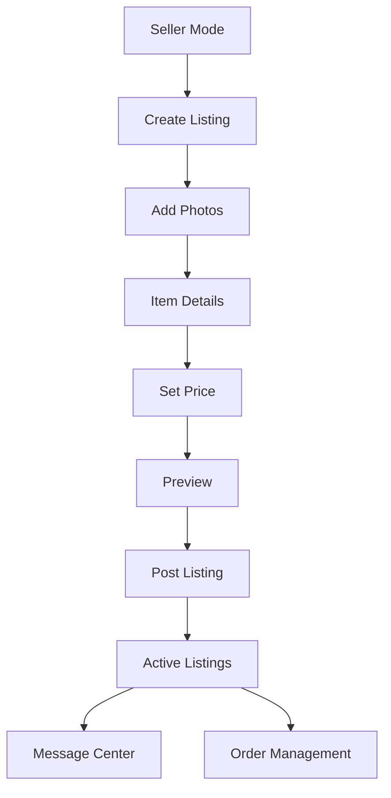
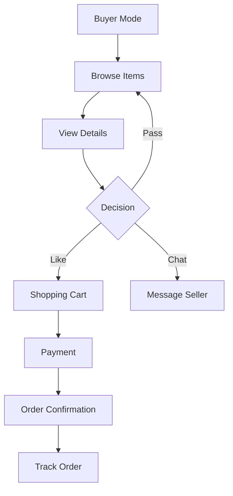
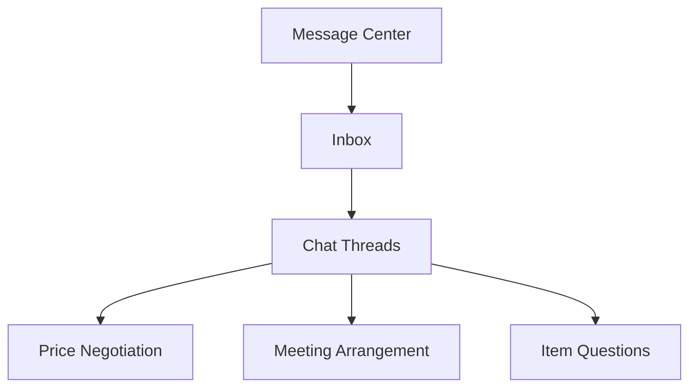

# Finder - Campus Marketplace App 🎓

[](https://flutterflow.io)

Finder is a campus-specific marketplace application that revolutionizes how college communities buy and sell items. Inspired by Tinder's intuitive interface, Finder creates a secure, anonymous platform for students and staff to trade items within their campus community.

🔗 **[Try Finder here](https://findar-usbq5f.flutterflow.app/)** 

## 📊 Project Presentation
View our [project presentation slides here](https://www.canva.com/design/DAGV8yq8KAk/klKNh6kRpGF2QDjar34g_A/view?utm_content=DAGV8yq8KAk&utm_campaign=designshare&utm_medium=link&utm_source=editor#1) to learn more about Finder’s features, design, and development process.

## 🎯 Problem Statement

College students often discard useful items during moves or upgrades, while others might need these same items. There's no efficient, campus-specific platform to connect these two groups. Finder bridges this gap while promoting sustainability.

## 🌟 Key Features

- **Campus-Restricted Access**: Secure .edu email verification
- **Tinder-Style Interface**: Intuitive swipe mechanics for browsing items
- **Anonymous Listings**: Privacy-first approach to buying and selling
- **Secure Messaging**: Built-in chat system for buyer-seller communication
- **Smart Categories**: Easy organization of items by type and condition
- **Order Tracking**: Real-time updates on purchase status

## 🔄 System Architecture

### Authentication Flow


### Seller Flow


### Buyer Flow


### Messaging System


## 💻 Technology Stack

- **Frontend**: Flutter/FlutterFlow
- **Backend**: Firebase
- **Authentication**: Firebase Auth
- **Database**: Cloud Firestore
- **Storage**: Firebase Storage
- **Messaging**: Firebase Cloud Messaging

## 🚀 Getting Started

### Prerequisites
- Flutter SDK
- FlutterFlow account
- Firebase project
- Android Studio / VS Code

### Installation

1. Clone the repository
```bash
git clone https://github.com/yourusername/finder-app.git
```

2. Navigate to the project directory
```bash
cd finder-app
```

3. Install dependencies
```bash
flutter pub get
```

4. Run the app
```bash
flutter run
```

## 👥 Team

### Core Developers
- **Md Khairul Islam**
  - Institution: Hobart and William Smith Colleges, Geneva, NY
  - Major: Robotics and Computer Science
  - Contact: khairul.islam@hws.edu | (315) 878-9695

- **Md Wasiful Karim**
  - Institution: Ohio Wesleyan University, Ohio, USA
  - Major: Astrophysics and Computer Science
  - Contact: mwkarim@owu.edu | (740) 803-6371

## 📱 App Screenshots


## 🤝 Contributing

We welcome contributions to Finder! for details on our code of conduct and the process for submitting pull requests.


Ohio Wesleyan University - For providing essential support, resources, and encouragement that enabled us to participate and thrive in this project.

- **Liam Davidson (OWU '25)** – For his invaluable feedback, technical expertise, and steadfast support during the hackathon. His dedication and insights helped shape our project’s direction and impact.
- **Evan Nolan (OWU '25)** – For his creativity and collaboration during brainstorming sessions. Evan's innovative ideas added depth and focus to the project.
- **Souvick Rodrigues (OWU '25)** – For his positive energy and musical talent that lifted team spirits. His singing kept morale high and made the experience even more enjoyable.


- **FlutterFlow team** - For providing an excellent development platform that made our rapid prototyping possible

- **Our College Communities** - For inspiration and continued support in making campus sustainability a priority

- **All contributors** - Who have helped shape this project through feedback and testing


## 📞 Contact

For any queries regarding the application, please contact either of the core developers listed above.

---
Made with ❤️ for College Communities
